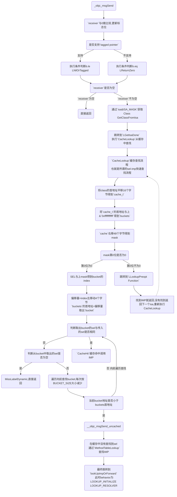
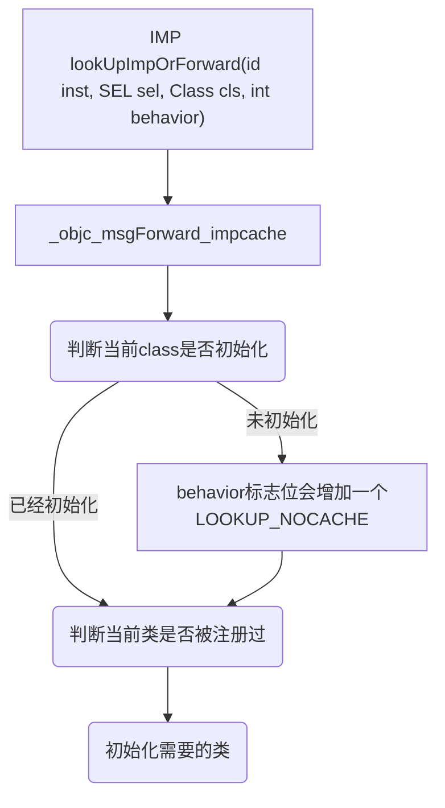

# iOS 消息转发流程 探究

> OC方法调用的本质是给对象发送消息:objc_msgSend()，这个流程可以分为三个阶段
> > 消息发送
> > 
> > 动态方法解析
> > 
> > 消息转发

## **消息发送**

* ***函数原型***

```
void objc_msgSend(void /* id self, SEL op, ... */)

其中第一参数是消息接收者，后面是要执行的方法。
```
* ***查找源码***

> 打开runtime源码 -> 搜索objc_msgSend -> 找到objc-msg-arm64.s文件 -> 找到ENTRY _objc_msgSend
> 
> 汇编使用 ENTRY + 函数名字 函数入口
> 
> 使用 END_ENTRY + 函数名字 函数结束

* ***objc_class***

```
struct objc_class: objc_object {
    Class isa;
    Class superclass;
    cache_t cache;       
    class_data_bits_t bits; 
    .....	
}
```
> cache: 在数据结构的第三位，下面会用到

* ***cache_t***

```
struct cache_t {
    struct bucket_t *_buckets;
    mask_t _mask;
    mask_t _occupied;
    .....	
}
```
> _buckets: 是bucket_t结构体数组，bucket_t存放方法的SEL和IMP
> 
> _mask: 数组的大小-1，用于掩码，-1用于保证相与后不超过缓存大小
> 
> _occupied: 当前缓存的方法数

* ***bucket_t***

```
typedef unsigned long 	uintptr_t;
typedef uintptr_t 	cache_key_t;

struct bucket_t {
    cache_key_t _key;
    MethodCacheIMP _imp;
}

cache_key_t key = getKey(sel);

cache_key_t getKey(SEL sel) {
    assert(sel);
    return (cache_key_t)sel;
}
```
> _key: unsigned long类型，用来存放SEL的内存地址
> 
> _imp: 方法实现的IMP

* ***_objc_msgSend***
```
ENTRY _objc_msgSend

	UNWIND _objc_msgSend, NoFrame

	/** 
	 *  nil check and tagged pointer check
	 *
	 *  po与0作比较,更新标志位
	 */ 
	cmp	p0, #0
	
#if SUPPORT_TAGGED_POINTERS
	// `receiver`小于等于`0`的时候跳转到 `LNilOrTagged`，否则不跳转
	b.le	LNilOrTagged		//  (MSB tagged pointer looks negative)
#else
	// `receiver`等于`0`的时候跳转到LReturnZero，否则不跳转
	b.eq	LReturnZero
#endif
	// 根据当前对象isa找到所属类
	ldr	p13, [x0]		// p13 = isa
	GetClassFromIsa_p16 p13, 1, x0	// p16 = class
LGetIsaDone:
	// calls imp or objc_msgSend_uncached
	CacheLookup NORMAL, _objc_msgSend, __objc_msgSend_uncached

#if SUPPORT_TAGGED_POINTERS
LNilOrTagged:
	b.eq	LReturnZero		// nil check
	GetTaggedClass
	b	LGetIsaDone
// SUPPORT_TAGGED_POINTERS
#endif

LReturnZero:
	// x0 is already zero
	mov	x1, #0
	movi	d0, #0
	movi	d1, #0
	movi	d2, #0
	movi	d3, #0
	ret
	
END_ENTRY _objc_msgSend
```
**_objc_msgSend 流程图**



**经过层层查找最终来到 *lookUpImpOrForward* 也就是所谓的 *慢速查找* 流程**

```
x0 = receiver 
x1 = selector 
x2 = class 
x3 = LOOKUP_INITIALIZE | LOOKUP_RESOLVER
根据不同的behavior会执行不同的分支

/* method lookup */
enum {
    LOOKUP_INITIALIZE = 1,
    LOOKUP_RESOLVER = 2,
    LOOKUP_NIL = 4,
    LOOKUP_NOCACHE = 8,
};

IMP lookUpImpOrForward(id inst, SEL sel, Class cls, int behavior) {
    const IMP forward_imp = (IMP)_objc_msgForward_impcache;
    IMP imp = nil;
    Class curClass;

    runtimeLock.assertUnlocked();

    /**
     * 如果cls没有初始化，behavior标志位会增加一个 LOOKUP_NOCACHE
     * 
     * 判断是否初始化取的是data()->flags的第29位
     */
    if (slowpath(!cls->isInitialized())) {
        behavior |= LOOKUP_NOCACHE;
    }
    
    runtimeLock.lock();

    /**
     * 检查类是否已经注册，注册后会加入allocatedClasses表中
     */
    checkIsKnownClass(cls);

    /**
     * 初始化需要的类，由于要去类中查找方法，如果rw，ro没有准备好那就没有办法查了
     */
    cls = realizeAndInitializeIfNeeded_locked(inst, cls, behavior & LOOKUP_INITIALIZE);
    
    // runtimeLock may have been dropped but is now locked again
    runtimeLock.assertLocked();
    
    curClass = cls;

    // 开始查找直到done或者break
    for (unsigned attempts = unreasonableClassCount();;) {
        if (curClass->cache.isConstantOptimizedCache(/* strict */true)) {
#if CONFIG_USE_PREOPT_CACHES
            imp = cache_getImp(curClass, sel);
            if (imp) goto done_unlock;
            curClass = curClass->cache.preoptFallbackClass();
#endif
        } else {
            // curClass method list.
            Method meth = getMethodNoSuper_nolock(curClass, sel);
            if (meth) {
                imp = meth->imp(false);
                goto done;
            }

            if (slowpath((curClass = curClass->getSuperclass()) == nil)) {
                // No implementation found, and method resolver didn't help.
                // Use forwarding.
                imp = forward_imp;
                break;
            }
        }

        // Halt if there is a cycle in the superclass chain.
        if (slowpath(--attempts == 0)) {
            _objc_fatal("Memory corruption in class list.");
        }

        // Superclass cache.
        imp = cache_getImp(curClass, sel);
        if (slowpath(imp == forward_imp)) {
            // Found a forward:: entry in a superclass.
            // Stop searching, but don't cache yet; call method
            // resolver for this class first.
            break;
        }
        if (fastpath(imp)) {
            // Found the method in a superclass. Cache it in this class.
            goto done;
        }
    }

    // No implementation found. Try method resolver once.

    if (slowpath(behavior & LOOKUP_RESOLVER)) {
        behavior ^= LOOKUP_RESOLVER;
        return resolveMethod_locked(inst, sel, cls, behavior);
    }

 done:
    if (fastpath((behavior & LOOKUP_NOCACHE) == 0)) {
#if CONFIG_USE_PREOPT_CACHES
        while (cls->cache.isConstantOptimizedCache(/* strict */true)) {
            cls = cls->cache.preoptFallbackClass();
        }
#endif
        log_and_fill_cache(cls, imp, sel, inst, curClass);
    }
 done_unlock:
    runtimeLock.unlock();
    if (slowpath((behavior & LOOKUP_NIL) && imp == forward_imp)) {
        return nil;
    }
    return imp;


    const IMP forward_imp = (IMP)_objc_msgForward_impcache;
    IMP imp = nil;
    Class curClass;

    runtimeLock.assertUnlocked();

    // Optimistic cache lookup
    // 如果behavior标识符需要再查找缓存的话，重新查找一遍缓存
    if (fastpath(behavior & LOOKUP_CACHE)) {
        imp = cache_getImp(cls, sel);
        if (imp) goto done_nolock;
    }

    runtimeLock.lock();

    checkIsKnownClass(cls);

    if (slowpath(!cls->isRealized())) {
    	// 如果类还没有实现，需要进行实现，这是一个递归的方法，确保父类以及元类的继承关系。
        cls = realizeClassMaybeSwiftAndLeaveLocked(cls, runtimeLock);
        // runtimeLock may have been dropped but is now locked again
    }

    if (slowpath((behavior & LOOKUP_INITIALIZE) && !cls->isInitialized())) {
    	// 如果没有初始化，需要初始化，会执行+initialize方法。
        cls = initializeAndLeaveLocked(cls, inst, runtimeLock);
    }

    runtimeLock.assertLocked();
    curClass = cls;

    for (unsigned attempts = unreasonableClassCount();;) {
        // curClass method list.
        // 在curClass中寻找方法，不在父类中寻找
        Method meth = getMethodNoSuper_nolock(curClass, sel);
        if (meth) {
            imp = meth->imp;
            goto done;
        }
	
        if (slowpath((curClass = curClass->superclass) == nil)) {
            // 如果curClass的父类为nil，还没找到，需要进行方法解析了
            // No implementation found, and method resolver didn't help.
            // Use forwarding.
            imp = forward_imp;
            break;
        }

        // Halt if there is a cycle in the superclass chain.
        // 如果父子类关系中有缓存在的话，attempts<0，发生异常
        if (slowpath(--attempts == 0)) {
            _objc_fatal("Memory corruption in class list.");
        }

        // Superclass cache.
        // 在父类缓存中查找缓存。
        imp = cache_getImp(curClass, sel);
        if (slowpath(imp == forward_imp)) {
            //如果父类中发现了forward的imp，停止查找，不进行缓存，先调用这个类的方法解析。
            break;
        }
        if (fastpath(imp)) {
            // 在父类中找到了方法实现，缓存到当前class即receiver对应的class中
            goto done;
        }
    }

    // No implementation found. Try method resolver once.
    (behavior = 11) & 10 = 10
    behavior = 11 ^ 10 = 01
    behavior = 01 & 10 = 0
    if (slowpath(behavior & LOOKUP_RESOLVER)) {
    	// 表示此处代码在本次流程中只会执行一次
        behavior ^= LOOKUP_RESOLVER;
        return resolveMethod_locked(inst, sel, cls, behavior);
    }

 done:
    // 存储sel以及imp到当前cls的缓存中去，此处衔接到cache_t的存储方法部分。
    log_and_fill_cache(cls, imp, sel, inst, curClass);
    runtimeLock.unlock();
 done_nolock:
    if (slowpath((behavior & LOOKUP_NIL) && imp == forward_imp)) {
    	// 如果当前behavior属于LOOKUP_NIL并且找到了forward_imp，返回空。
        return nil;
    }
    return imp;
}
```

**lookUpImpOrForward流程图**




