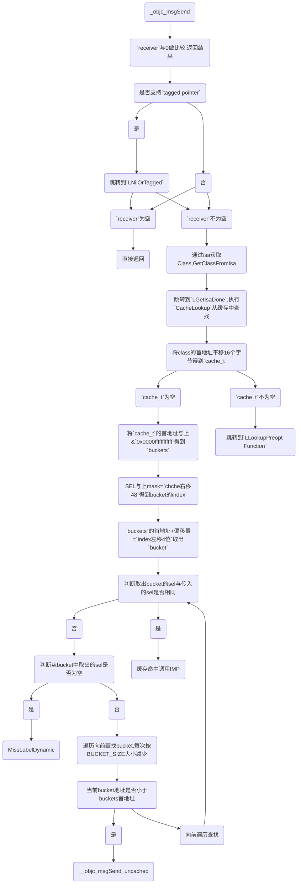

# iOS 消息转发流程 探究

> OC方法调用的本质是给对象发送消息:objc_msgSend()，这个流程可以分为三个阶段
> > 消息发送
> > 
> > 动态方法解析
> > 
> > 消息转发

## **消息发送**

* ***函数原型***

```
void objc_msgSend(void /* id self, SEL op, ... */)

其中第一参数是消息接收者，后面是要执行的方法。
```
* ***查找源码***

> 打开runtime源码 -> 搜索objc_msgSend -> 找到objc-msg-arm64.s文件 -> 找到ENTRY _objc_msgSend
> 
> 汇编使用 ENTRY + 函数名字 函数入口
> 
> 使用 END_ENTRY + 函数名字 函数结束

* ***objc_class***

```
struct objc_class: objc_object {
    Class isa;
    Class superclass;
    cache_t cache;       
    class_data_bits_t bits; 
    .....	
}
```
> cache: 在数据结构的第三位，下面会用到

* ***cache_t***

```
struct cache_t {
    struct bucket_t *_buckets;
    mask_t _mask;
    mask_t _occupied;
    .....	
}
```
> _buckets: 是bucket_t结构体数组，bucket_t存放方法的SEL和IMP
> 
> _mask: 数组的大小-1，用于掩码，-1用于保证相与后不超过缓存大小
> 
> _occupied: 当前缓存的方法数

* ***bucket_t***

```
typedef unsigned long 	uintptr_t;
typedef uintptr_t 	cache_key_t;

struct bucket_t {
    cache_key_t _key;
    MethodCacheIMP _imp;
}

cache_key_t key = getKey(sel);

cache_key_t getKey(SEL sel) 
{
    assert(sel);
    return (cache_key_t)sel;
}
```
> _key: unsigned long类型，用来存放SEL的内存地址
> 
> _imp: 方法实现的IMP

* ***_objc_msgSend***
```
ENTRY _objc_msgSend

	UNWIND _objc_msgSend, NoFrame

	/** 
	 *  nil check and tagged pointer check
	 *
	 *  po与0作比较
	 */ 
	cmp	p0, #0
	
#if SUPPORT_TAGGED_POINTERS
	// less than or equal to)的意思当结果为小于等于的时候跳转执行
	b.le	LNilOrTagged		//  (MSB tagged pointer looks negative)
#else
	// 比较结果是等于（equal to），执行LReturnZero，否则不跳转
	b.eq	LReturnZero
#endif
	// 根据当前对象isa找到所属类
	ldr	p13, [x0]		// p13 = isa
	GetClassFromIsa_p16 p13, 1, x0	// p16 = class
LGetIsaDone:
	// calls imp or objc_msgSend_uncached
	CacheLookup NORMAL, _objc_msgSend, __objc_msgSend_uncached

#if SUPPORT_TAGGED_POINTERS
LNilOrTagged:
	b.eq	LReturnZero		// nil check
	GetTaggedClass
	b	LGetIsaDone
// SUPPORT_TAGGED_POINTERS
#endif

LReturnZero:
	// x0 is already zero
	mov	x1, #0
	movi	d0, #0
	movi	d1, #0
	movi	d2, #0
	movi	d3, #0
	ret
	
END_ENTRY _objc_msgSend
```
**_objc_msgSend 流程图**


