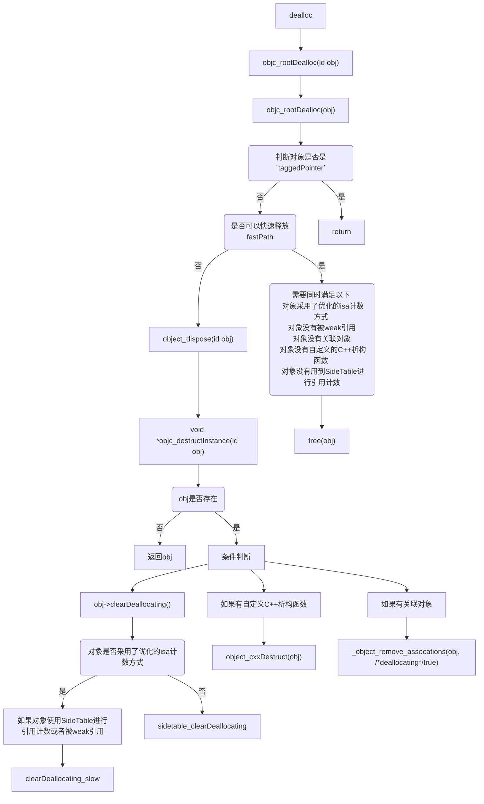

# dealloc 探究

* **dealloc**
```
- (void)dealloc {
    _objc_rootDealloc(self);
}

void _objc_rootDealloc(id obj) {
    ASSERT(obj);
    obj->rootDealloc();
}
```

* **rootDealloc**
```
inline void objc_object::rootDealloc() {
    if (isTaggedPointer()) return;  // fixme necessary?

    if (fastpath(isa.nonpointer                     &&
                 !isa.weakly_referenced             &&
                 !isa.has_assoc                     &&
#if ISA_HAS_CXX_DTOR_BIT
                 !isa.has_cxx_dtor                  &&
#else
                 !isa.getClass(false)->hasCxxDtor() &&
#endif
                 !isa.has_sidetable_rc)) {
        assert(!sidetable_present());
        free(this);
    } else {
        object_dispose((id)this);
    }
}
```

* **objc_destructInstance**
```
id object_dispose(id obj) {
    if (!obj) return nil;

    objc_destructInstance(obj);    
    free(obj);

    return nil;
}

void *objc_destructInstance(id obj) {
    if (obj) {
        // Read all of the flags at once for performance.
        bool cxx = obj->hasCxxDtor();
        bool assoc = obj->hasAssociatedObjects();

        // This order is important.
        if (cxx) object_cxxDestruct(obj);
        if (assoc) _object_remove_assocations(obj, /*deallocating*/true);
        obj->clearDeallocating();
    }

    return obj;
}

inline void objc_object::clearDeallocating() {
    if (slowpath(!isa.nonpointer)) {
        // Slow path for raw pointer isa.
        sidetable_clearDeallocating();
    } else if (slowpath(isa.weakly_referenced  ||  isa.has_sidetable_rc)) {
        // Slow path for non-pointer isa with weak refs and/or side table data.
        clearDeallocating_slow();
    }

    assert(!sidetable_present());
}

void objc_object::sidetable_clearDeallocating() {
    SideTable& table = SideTables()[this];

    // clear any weak table items
    // clear extra retain count and deallocating bit
    // (fixme warn or abort if extra retain count == 0 ?)
    table.lock();
    RefcountMap::iterator it = table.refcnts.find(this);
    if (it != table.refcnts.end()) {
        if (it->second & SIDE_TABLE_WEAKLY_REFERENCED) {
            weak_clear_no_lock(&table.weak_table, (id)this);
        }
        table.refcnts.erase(it);
    }
    table.unlock();
}
```

* **dealloc流程图**


