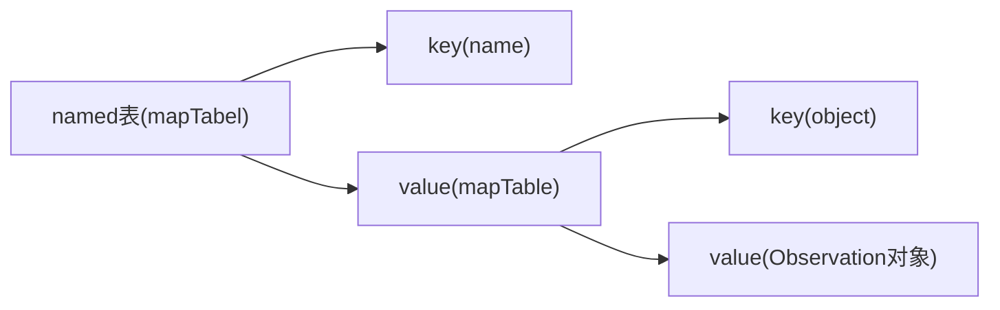
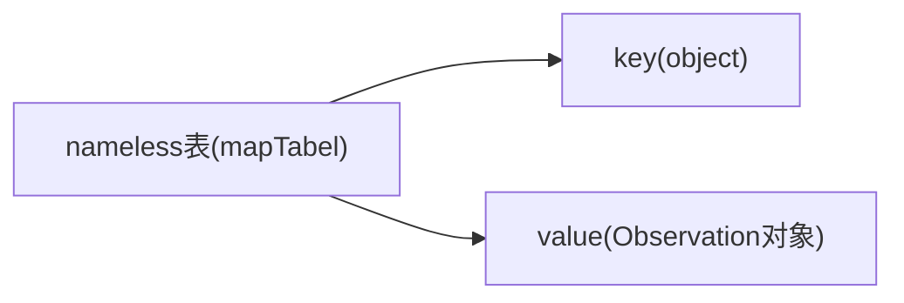
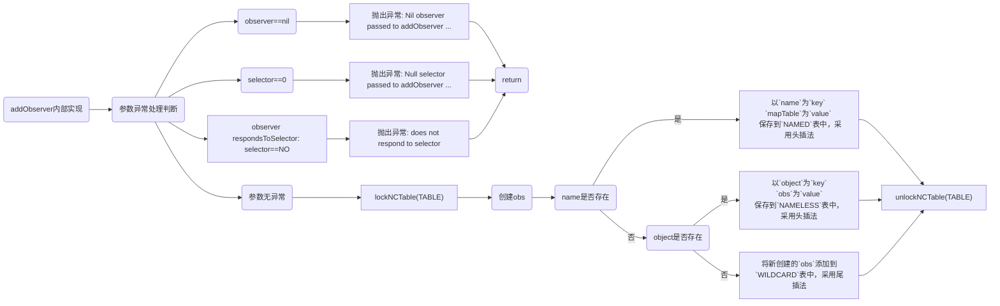

# NSNotificationCenter

## 目录
## NSNotificationCenter_OC版本

### 1、[Observation](#Observation)
### 2、[NCTable](#NCTable)
### 3、[GSIMapTable](#GSIMapTable)
### 4、[GSIMapBucket](#GSIMapBucket)
### 5、[GSIMapNode](#GSIMapNode)
### 6、[NAMED表结构](#NAMED表结构)
### 7、[NAMELESS表结构](#NAMELESS表结构)
### 8、[addObserver](#addObserver)
### 9、[obs创建流程](#obs创建流程)

## NSNotificationCenter_Swift版本

### Observation

```
typedef struct Obs {
    id  observer;       /* Object to receive message.   */
    SEL selector;       /* Method selector.             */
    int retained;       /* Retain count for structure.  */
    struct Obs *next;   /* Next item in linked list.    */
    struct NCTbl *link; /* Pointer back to chunk table. */
} Observation;
```

## NCTable
```
#define	CHUNKSIZE	128
#define	CACHESIZE	16
typedef struct NCTbl {
    Observation		*wildcard;	/* Get ALL messages.		*/
    GSIMapTable		nameless;	/* Get messages for any name.	*/
    GSIMapTable		named;		/* Getting named messages only.	*/
    unsigned		lockCount;	/* Count recursive operations.	*/
    NSRecursiveLock	*_lock;		/* Lock out other threads.	*/
    Observation		*freeList;
    Observation		**chunks;
    unsigned		numChunks;
    GSIMapTable		cache[CACHESIZE];
    unsigned short	chunkIndex;
    unsigned short	cacheIndex;
} NCTable;

#define	TABLE		((NCTable*)_table)
#define	WILDCARD	(TABLE->wildcard)
#define	NAMELESS	(TABLE->nameless)
#define	NAMED		(TABLE->named)
#define	LOCKCOUNT	(TABLE->lockCount)
```

### GSIMapTable

> typedef struct _GSIMapTable GSIMapTable_t;
> 
> typedef GSIMapTable_t *GSIMapTable;

```
struct	_GSIMapTable {
	NSZone	*zone;
	uintptr_t	nodeCount;	/* Number of used nodes in map.	*/
	uintptr_t	bucketCount;/* Number of buckets in map.	*/
	GSIMapBucket buckets;	/* Array of buckets.		*/
	GSIMapNode	freeNodes;	/* List of unused nodes.	*/
	uintptr_t	chunkCount;	/* Number of chunks in array.	*/
	GSIMapNode	*nodeChunks;/* Chunks of allocated memory.	*/
	uintptr_t	increment;
#ifdef	GSI_MAP_EXTRA
	GSI_MAP_EXTRA	extra;
#endif
};
```

### GSIMapBucket

> typedef GSIMapBucket_t *GSIMapBucket;

```
struct _GSIMapBucket {
    uintptr_t nodeCount; /* Number of nodes in bucket.    */
    GSIMapNode firstNode;/* The linked list of nodes.    */
};
```

### GSIMapNode

> typedef struct _GSIMapNode GSIMapNode_t;
> 
> typedef GSIMapNode_t *GSIMapNode;

```
struct  _GSIMapNode {
    GSIMapNode nextInBucket; /* Linked list of bucket. */
    GSIMapKey key;
#if    GSI_MAP_HAS_VALUE
    GSIMapVal value;
#endif
};
```

### NAMED表结构



### NAMELESS表结构



## addObserver
```
- (void)addObserver: (id)observer selector: (SEL)selector name: (NSString*)name object: (id)object {
    
    // 异常处理判断
    if (observer == nil) 
        [NSException raise: NSInvalidArgumentException
                    format: @"Nil observer passed to addObserver ..."];

    if (selector == 0)
        [NSException raise: NSInvalidArgumentException
                     format: @"Null selector passed to addObserver ..."];

    if ([observer respondsToSelector: selector] == NO) {
        [NSException raise: NSInvalidArgumentException
                    format: @"[%@-%@] Observer '%@' does not respond to selector '%@'",
                    NSStringFromClass([self class]), NSStringFromSelector(_cmd),
                    observer, NSStringFromSelector(selector)];
    }

    // 加锁 TABLE
    lockNCTable(TABLE);

    // 创建Obs
    Observation *o = obsNew(TABLE, selector, observer);
    
    Observation	*list;
    GSIMapTable	m;
    GSIMapNode	n;

    if (name) { // 如果name存在
    
        // 根据 `name` 从 `NAMED` 表中取出 `MapNode`
        n = GSIMapNodeForKey(NAMED, (GSIMapKey)(id)name);
	
		// map->nodeCount == 0，NAMED表中没有node
        if (n == 0) {
	
	    // 如果`table->cacheIndex` > 0, 从`table->cache[--table->cacheIndex]`取出mapTable
	    // 否则新创建一个mapTable
            m = mapNew(TABLE);
            
            name = [name copyWithZone: NSDefaultMallocZone()];
	    
	    // 以`name`为`key`，`mapTable`为`value`，保存到`NAMED`表中
            GSIMapAddPair(NAMED, (GSIMapKey)(id)name, (GSIMapVal)(void*)m);
            GS_CONSUMED(name);
        } else {
	    // 在NAMED表中找到以name为key的mapTable
            m = (GSIMapTable)n->value.ptr;
        }

       	// 判断参数`object`是否为空
		// 以`object`为`key`，从`mapTable`中取出`mapNode`
        n = GSIMapNodeForSimpleKey(m, (GSIMapKey)object);
	
		// `map->nodeCount` == 0，`mapTable`表中没有`node`
        if (n == 0) { 
            o->next = ENDOBS; // 当前插入的`obs`是链表的最后一个节点
	    // 以`object`为`key`, `obs`为`value`，保存在`mapTable`中
            GSIMapAddPair(m, (GSIMapKey)object, (GSIMapVal)o);
        } else { // `mapTable`中存在以`object`为`key`的`obs`
            list = (Observation *)n->value.ptr;
	    
	    // 采用头插法，将新创建的`obs`添加到头部
            o->next = list->next;
            list->next = o;
        }
    } else if (object) { // name不存在，object存在
    
    	// 根据 `object` 从 `NAMELESS` 表中取出 `MapNode`
        n = GSIMapNodeForSimpleKey(NAMELESS, (GSIMapKey)object);
	
		// map->nodeCount == 0，NAMELESS表中没有node
        if (n == 0) {
            o->next = ENDOBS;
	    // 以`object`为`key`，`obs`为`value`，保存到`NAMELESS`表中
            GSIMapAddPair(NAMELESS, (GSIMapKey)object, (GSIMapVal)o);
        } else {
            list = (Observation*)n->value.ptr;
	    // 采用头插法，将新创建的`obs`添加到头部
            o->next = list->next;
            list->next = o;
        }
    } else {// 没有 name、object
    	// 采用尾插法，将新创建的`obs`添加到尾部
        o->next = WILDCARD;
        WILDCARD = o;
    }
    // 解锁 TABLE
    unlockNCTable(TABLE);
}
```

* **addObserver流程图**


### obs创建流程
```
static Observation *obsNew(NCTable *t, SEL s, id o) {
    if (t->freeList == 0) {
        if (t->chunkIndex == CHUNKSIZE) {
            t->numChunks++;
            unsigned size = t->numChunks * sizeof(Observation *);
            t->chunks = (Observation**)NSReallocateCollectable(t->chunks, size, NSScannedOption);

            size = CHUNKSIZE * sizeof(Observation);
            t->chunks[t->numChunks - 1] = (Observation *)NSAllocateCollectable(size, 0);
            t->chunkIndex = 0;
        }
        Observation    *block = t->chunks[t->numChunks - 1];
        t->freeList = &block[t->chunkIndex];
        t->chunkIndex++;
        t->freeList->link = 0;
    }
    Observation *obs = t->freeList;
    t->freeList = (Observation *)obs->link;
    obs->link = (void *)t;
    obs->retained = 0;
    obs->next = 0;

    obs->selector = s;
    obs->observer = o;

    return obs;
}
```

## postNotification

```
- (void) postNotificationName: (NSString *)name object: (id)object
{
	[self postNotificationName: name object: object userInfo: nil];
}

- (void) postNotificationName: (NSString *)name object: (id)object userInfo: (NSDictionary *)info
{
	GSNotification *notification = (id)NSAllocateObject(concrete, 0, NSDefaultMallocZone());
	notification->_name = [name copyWithZone: [self zone]];
	notification->_object = [object retain];
	notification->_info = [info retain];
	[self _postAndRelease: notification];
}

- (void) _postAndRelease: (NSNotification *)notification
{
    Observation *o;
    unsigned count;
    GSIMapNode n;
    GSIMapTable m;
    NSString *name = [notification name];

    // name 为nil，抛出异常
    if (name == nil) {
        RELEASE(notification);
        [NSException raise: NSInvalidArgumentException
                    format: @"Tried to post a notification with no name."];
    }

    id object = [notification object];

    GSIArray_t b;
    GSIArray a = &b;
    GSIArrayItem i[64];
    GSIArrayInitWithZoneAndStaticCapacity(a, _zone, 64, i);

    lockNCTable(TABLE);

    // 先从`WILDCARD`表中查找所有`observers`，并将`observers`保存到数组中
    for (o = WILDCARD = purgeCollected(WILDCARD); o != ENDOBS; o = o->next) {
        GSIArrayAddItem(a, (GSIArrayItem)o);
    }

    // 如果`object`存在
    if (object) {
        // 根据`object`为`key`，从`NEMELESS`表中查找`mapNode`
        n = GSIMapNodeForSimpleKey(NAMELESS, (GSIMapKey)object);
        if (n != 0) { //
            o = purgeCollectedFromMapNode(NAMELESS, n);
            while (o != ENDOBS) {
                  GSIArrayAddItem(a, (GSIArrayItem)o);
                  o = o->next;
            }
        }
    }

    if (name) {
        n = GSIMapNodeForKey(NAMED, (GSIMapKey)((id)name));
        if (n) {
            m = (GSIMapTable)n->value.ptr;
        } else {
            m = 0;
        }
        if (m != 0) {
            n = GSIMapNodeForSimpleKey(m, (GSIMapKey)object);
            if (n != 0) {
                o = purgeCollectedFromMapNode(m, n);
                while (o != ENDOBS) {
                    GSIArrayAddItem(a, (GSIArrayItem)o);
                    o = o->next;
                }
            }

            if (object != nil) {
                n = GSIMapNodeForSimpleKey(m, (GSIMapKey)(id)nil);
                if (n != 0) {
                    o = purgeCollectedFromMapNode(m, n);
                    while (o != ENDOBS) {
                        GSIArrayAddItem(a, (GSIArrayItem)o);
                        o = o->next;
                    }
                }
            }
        }
    }

    unlockNCTable(TABLE);

    /*
    * Now send all the notifications.
    */
    count = GSIArrayCount(a);
    while (count-- > 0) {
        o = GSIArrayItemAtIndex(a, count).ext;
        if (o->next != 0) {
            NS_DURING
            {
                [o->observer performSelector: o->selector withObject: notification];
            }
            NS_HANDLER
            {
                BOOL logged;
                NS_DURING
                    NSLog(@"Problem posting %@: %@", notification, localException);
                    logged = YES;
                NS_HANDLER
                    logged = NO;
                NS_ENDHANDLER
                if (NO == logged) {
                    NSLog(@"Problem posting notification: %@", localException);
                }
            }
            NS_ENDHANDLER
        }
    }
    lockNCTable(TABLE);
    GSIArrayEmpty(a);
    unlockNCTable(TABLE);

    RELEASE(notification);
}


```
