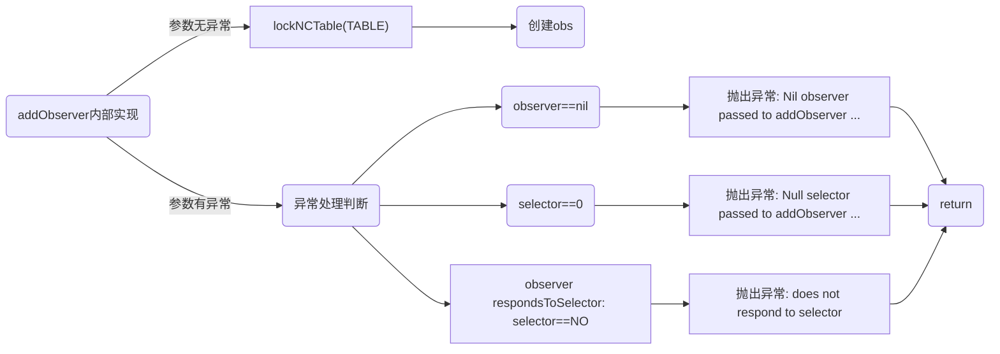

# NSNotificationCenter


## [NSNotificationCenter_OC版本](#NSNotificationCenter_OC版本)


## NSNotificationCenter_OC版本

```
typedef	struct Obs {
  id	observer;	/* Object to receive message.	*/
  SEL	selector;	/* Method selector.	*/
  struct Obs *next;	/* Next item in linked list.	*/
  int	retained;	/* Retain count for structure.	*/
  struct NCTbl *link;	/* Pointer back to chunk table	*/
} Observation;

#define	CHUNKSIZE	128
#define	CACHESIZE	16
typedef struct NCTbl {
  Observation		*wildcard;	/* Get ALL messages.		*/
  GSIMapTable		nameless;	/* Get messages for any name.	*/
  GSIMapTable		named;		/* Getting named messages only.	*/
  unsigned		lockCount;	/* Count recursive operations.	*/
  NSRecursiveLock	*_lock;		/* Lock out other threads.	*/
  Observation		*freeList;
  Observation		**chunks;
  unsigned		numChunks;
  GSIMapTable		cache[CACHESIZE];
  unsigned short	chunkIndex;
  unsigned short	cacheIndex;
} NCTable;

#define	TABLE		((NCTable*)_table)
#define	WILDCARD	(TABLE->wildcard)
#define	NAMELESS	(TABLE->nameless)
#define	NAMED		(TABLE->named)
#define	LOCKCOUNT	(TABLE->lockCount)
```
## addObserver:selector:name:object



### obs创建流程

```
static Observation *obsNew(NCTable *t, SEL s, id o) {
    if (t->freeList == 0) {
        if (t->chunkIndex == CHUNKSIZE) {
	        t->numChunks++;
	        unsigned size = t->numChunks * sizeof(Observation *);
	        t->chunks = (Observation**)NSReallocateCollectable(t->chunks, size, NSScannedOption);

	        size = CHUNKSIZE * sizeof(Observation);
	        t->chunks[t->numChunks - 1] = (Observation *)NSAllocateCollectable(size, 0);
	        t->chunkIndex = 0;
	    }
        Observation	*block = t->chunks[t->numChunks - 1];
        t->freeList = &block[t->chunkIndex];
        t->chunkIndex++;
        t->freeList->link = 0;
    }
    Observation	*obs = t->freeList;
    t->freeList = (Observation *)obs->link;
    obs->link = (void *)t;
    obs->retained = 0;
    obs->next = 0;

    obs->selector = s;
    obs->observer = o;

    return obs;
}
```
创建流程图

```mermaid
graph LR


```


```
- (void)addObserver: (id)observer selector: (SEL)selector name: (NSString*)name object: (id)object {
    Observation	*list;
    GSIMapTable	m;
    GSIMapNode	n;
    
    // 异常处理判断
    if (observer == nil) 
        [NSException raise: NSInvalidArgumentException
                    format: @"Nil observer passed to addObserver ..."];

    if (selector == 0)
        [NSException raise: NSInvalidArgumentException
                     format: @"Null selector passed to addObserver ..."];

    if ([observer respondsToSelector: selector] == NO) {
        [NSException raise: NSInvalidArgumentException
                    format: @"[%@-%@] Observer '%@' does not respond to selector '%@'",
                    NSStringFromClass([self class]), NSStringFromSelector(_cmd),
                    observer, NSStringFromSelector(selector)];
    }

    lockNCTable(TABLE);

    // 创建Obs
    Observation *o = obsNew(TABLE, selector, observer);

    if (name) { // 如果name存在
       
        // 根据 na
     
        n = GSIMapNodeForKey(NAMED, (GSIMapKey)(id)name);
        if (n == 0) {
            m = mapNew(TABLE);
            /*
            * As this is the first observation for the given name, we take a
            * copy of the name so it cannot be mutated while in the map.
            */
            name = [name copyWithZone: NSDefaultMallocZone()];
            GSIMapAddPair(NAMED, (GSIMapKey)(id)name, (GSIMapVal)(void*)m);
            GS_CONSUMED(name);
        } else {
            m = (GSIMapTable)n->value.ptr;
        }

        /*
        * Add the observation to the list for the correct object.
        */
        n = GSIMapNodeForSimpleKey(m, (GSIMapKey)object);
        if (n == 0) {
            o->next = ENDOBS;
            GSIMapAddPair(m, (GSIMapKey)object, (GSIMapVal)o);
        } else {
            list = (Observation*)n->value.ptr;
            o->next = list->next;
            list->next = o;
        }
    } else if (object) {
        n = GSIMapNodeForSimpleKey(NAMELESS, (GSIMapKey)object);
        if (n == 0) {
            o->next = ENDOBS;
            GSIMapAddPair(NAMELESS, (GSIMapKey)object, (GSIMapVal)o);
        } else {
            list = (Observation*)n->value.ptr;
            o->next = list->next;
            list->next = o;
        }
    } else {
        o->next = WILDCARD;
        WILDCARD = o;
    }
    unlockNCTable(TABLE);
}
```
