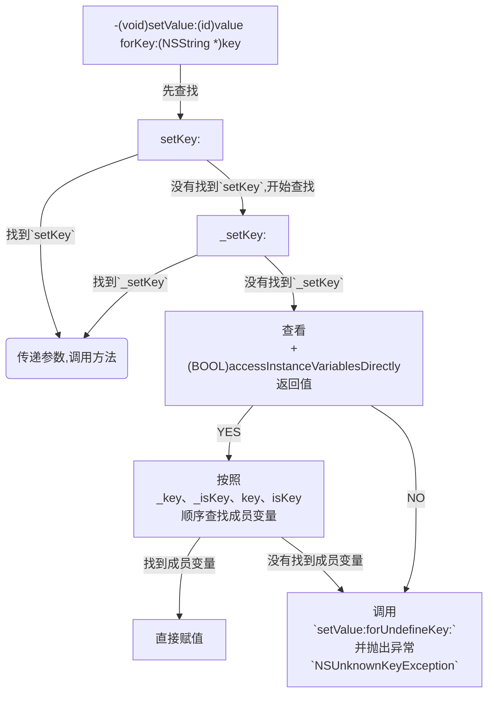
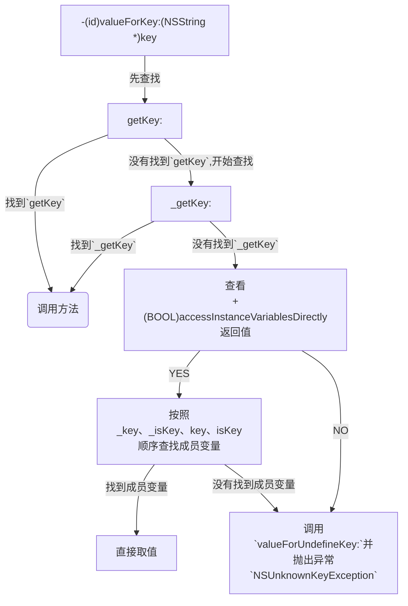

# iOS KVC 探究

* **KVC** 

KVC全称`Key-Value Coding`，键值编码，通过key来获取属性值。

常用API：

> -(void)setValue:(id)value forKey:(NSString *)key;
> 
> -(void)setValue:(id)value forKeyPath:(NSString *)keyPath;
> 
> -(id)valueForKey:(NSString *)key;
> 
> -(id)valueForKeyPath:(NSString *)keyPath;

* **setValue:forKey:实现原理流程图**

* **valueForKey:实现原理流程图**

