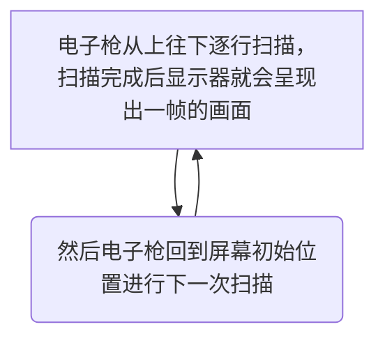

# iOS 界面渲染 探究

## 目录

一、[位图](#位图)

二、[物理像素和逻辑像素](#物理像素和逻辑像素)

三、[位图如何绘制到屏幕](#位图如何绘制到屏幕)

四、[位图的产生](#位图的产生)

> 1、[CPU](#CPU)
> 
> 2、[GPU](#GPU)

五、[iOS图形渲染技术](#iOS图形渲染技术)

六、[UIView与CALayer的关系](#UIView与CALayer的关系)

七、[CoreAnmiation绘制流程](#CoreAnmiation绘制流程)

## 位图

定义：(Bitmap)屏幕上绘制图像的原始数据。

特点：

> Bitmap是一种数据结构，一个Bitmap是由 `n * m` 个像素组成，每个像素的颜色由 `RGB` 组合或者 `灰度值` 组成。
> 
> 根据位深度，Bitmap可分为1、4、8、16、24、32位图像。
> 
> 每个像素使用的Bitmap信息位数越多，可用的颜色就越多，颜色表现就越逼真，越丰富，相应的数据量越大。

## 物理像素和逻辑像素

位图一般存储的是物理像素，而应用层一般用的是逻辑像素。

## 位图如何绘制到屏幕

当电子枪换行扫描时，会发出水平同步信号，水平同步信号决定CRT画一条横越屏幕线的时间；

当电子枪回到屏幕初始位置准备画下一帧画面时，会发出垂直同步信号，垂直同步信号决定从屏幕顶部画到底部，在回到初始位置的时间，代表CRT显示器的刷新率水平。

## 位图的产生

位图数据是通过 CPU、GPU 协同工作得到的。

### CPU

CPU是中央处理器，适合单一复杂逻辑。

### GPU

GPU是图形处理器，适合高并发简单逻辑。

## iOS图形渲染技术

> UIKit：通过设置 `UIKit` 组件的布局以及相关属性来绘制界面。但是其并不具备在屏幕成像的能力，这个框架主要负责对用户操作事件的响应，事件经过响应链传递，核心是UIView;
> 
> Core Graphics：用于运行时绘制图像，可用来绘制 `路径`、`颜色`、`阴影`、`离屏渲染`、`颜色转换` 等；
> 
> Core Animation：负责组合屏幕上不同的可视内容，这些可视内容被分解为独立的图层 `CALayer` 主要负责界面的渲染；大部分工作由GPU完成；
>  
> Core Image：用于运行时创建图像；
> 
> OpenGL ES 和 Metal：是第三方标准，基于这些标准具体的内部实现是由对应的 GPU 厂商开发的；Metal由苹果开发；

## UIView与CALayer的关系

> 1、`UIView` 提供对 `CALayer` 功能的封装，负责界面交互；
>
> 2、`CALayer` 是 `UIView` 的属性，负责动画和渲染；`CALayer` 有一个 `content` 属性，保存设备渲染流水线渲染好的位图 `bitmap（backing store）`，也就是原始数据，当设备屏幕进行刷新时，会从 `CALayer` 中读取生成好的 `bitmap`，进而呈现到屏幕上；

`UIView` 好比是一个画板，`CALayer` 是画布，画板可以移动，画布负责展示；

## CoreAnmiation绘制流程
