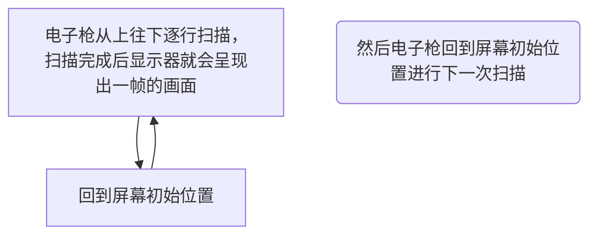

# iOS 界面渲染 探究

## 目录

一、[位图](#位图)

二、[物理像素和逻辑像素](#物理像素和逻辑像素)

三、[位图如何绘制到屏幕](#位图如何绘制到屏幕)

四、[位图的产生](#位图的产生)

> 1、[CPU](#CPU)
> 
> 2、[GPU](#GPU)

5、[内存管理](#内存管理)

## 位图

定义：(Bitmap)屏幕上绘制图像的原始数据。

特点：

> Bitmap是一种数据结构，一个Bitmap是由 `n * m` 个像素组成，每个像素的颜色由 `RGB` 组合或者 `灰度值` 组成。
> 
> 根据位深度，Bitmap可分为1、4、8、16、24、32位图像。
> 
> 每个像素使用的Bitmap信息位数越多，可用的颜色就越多，颜色表现就越逼真，越丰富，相应的数据量越大。

## 物理像素和逻辑像素

位图一般存储的是物理像素，而应用层一般用的是逻辑像素。

## 位图如何绘制到屏幕

当电子枪换行扫描时，会发出水平同步信号，水平同步信号决定CRT画一条横越屏幕线的时间；

当电子枪回到屏幕初始位置准备画下一帧画面时，会发出垂直同步信号，垂直同步信号决定从屏幕顶部画到底部，在回到初始位置的时间，代表CRT显示器的刷新率水平。

## 位图的产生

位图数据是通过 CPU、GPU 协同工作得到的。

### CPU

### GPU

