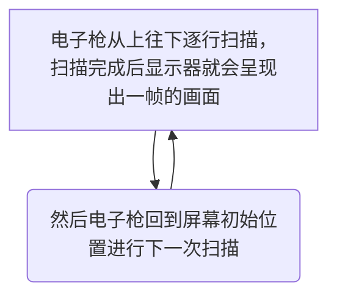

# iOS 界面渲染 探究

## 目录

一、[位图](#位图)

二、[位图的产生](#位图的产生)

三、[位图如何绘制到屏幕](#位图如何绘制到屏幕)

四、[渲染流水线](#渲染流水线)

五、[屏幕撕裂及解决方案](#屏幕撕裂及解决方案)

六、[掉帧及解决方案](#掉帧及解决方案)

七、[屏幕卡顿的本质](#屏幕卡顿的本质)

八、[iOS图形渲染技术](#iOS图形渲染技术)

九、[UIView与CALayer的关系](#UIView与CALayer的关系)

十、[Core-Anmiation绘制流程](#Core-Anmiation绘制流程)

、[离屏渲染](#离屏渲染)


## 位图

定义：(Bitmap)屏幕上绘制图像的原始数据。

特点：

> Bitmap是一种数据结构，一个Bitmap是由 `n * m` 个像素组成，每个像素的颜色由 `RGB` 组合或者 `灰度值` 组成。
> 
> 根据位深度，Bitmap可分为1、4、8、16、24、32位图像。
> 
> 每个像素使用的Bitmap信息位数越多，可用的颜色就越多，颜色表现就越逼真，越丰富，相应的数据量越大。

## 位图的产生

位图数据是通过 CPU、GPU 协同工作得到的。

> 1、CPU是中央处理器，适合单一复杂逻辑。
> 
> 2、GPU是图形处理器，适合高并发简单逻辑。

## 位图如何绘制到屏幕


当电子枪换行扫描时，会发出水平同步信号，水平同步信号决定CRT画一条横越屏幕线的时间；

当电子枪回到屏幕初始位置准备画下一帧画面时，会发出垂直同步信号，垂直同步信号决定从屏幕顶部画到底部，在回到初始位置的时间，代表CRT显示器的刷新率水平。

## 渲染流水线

> 1、应用处理阶段：得到图元(primitives)
> 
>> 应用对图像进行一系列的操作或者改变，将得到的图像信息传递给下一阶段，新得到的信息叫图元，通常是三角形、线段、顶点等，这个阶段在CPU阶段处理。
>
> 2、几何处理阶段：处理图元
> 
>> GPU 会对应用处理阶段得到的这部分图元进行处理，之后输出新的图元。这一阶段包括：顶点着色器、形状搭配、几何着色器。
>> 
>>> 2.1、顶点着色器(Vertex Shader)：这个阶段中会将图元中的顶点信息进行视角转换、添加光照信息、增加纹理等操作。
>>> 
>>> 2.2、形状搭配(Shape Assembly)：图元中的三角形、线段、点分别对应三个 Vertex、两个 Vertex、一个 Vertex。这个阶段会将 Vertex 连接成相对应的形状。
>>> 
>>> 2.3、几何着色器(Geometry Shader)：额外添加额外的Vertex，将原始图元转换成新图元，以构建一个不一样的模型。简单来说就是基于通过三角形、线段和点构建更复杂的几何图形。
> 
> 3、光栅化阶段：将几何处理阶段渲染之后的图元信息，转换为一系列的像素。
> 
> 4、像素处理阶段：处理像素，得到位图，这一阶段包括：片段着色器、测试与混合。
> 
>>  4.1、片段着色器：这个阶段的目的是给每一个像素 Pixel 赋予正确的颜色。颜色的来源就是之前得到的顶点、纹理、光照等信息。由于需要处理纹理、光照等复杂信息，所以这通常是整个系统的性能瓶颈。
>>  
>>  4.2、测试与混合：处理片段的前后位置以及透明度。

## 屏幕撕裂及解决方案

定义：如果在电子束开始扫描新的一帧时，位图还没有渲染好，而是在扫描到屏幕中间时才渲染完成，被放入帧缓冲器中，那么已扫描的部分就是上一帧的画面，而未扫描的部分则会显示新的一帧图像，这就造成屏幕撕裂。

单一缓存的模式下，最理想的情况就是一个流畅的流水线：每次电子束从头开始新的一帧的扫描时，CPU+GPU 对于该帧的渲染流程已经结束，渲染好的位图已经放入帧缓冲器中，这种情况下很容易发生屏幕撕裂。

### 垂直同步信号 + 双缓存机制

> 1、垂直同步信号（vertical synchronisation，Vsync）相当于给帧缓冲器加锁：当电子束完成一帧的扫描，将要从头开始扫描时，就会发出一个垂直同步信号。只有当视频控制器接收到 Vsync 之后，才会将帧缓冲器中的位图更新为下一帧，这样就能保证每次显示的都是同一帧的画面，因而避免了屏幕撕裂。
> 
> 2、双缓冲机制会增加一个新的备用缓冲器（back buffer）。渲染结果会预先保存在 `back buffer` 中，在接收到 Vsync 信号的时候，视频控制器会将 `back buffer` 中的内容置换到 `frame buffer` 中，此时就能保证置换操作几乎在一瞬间完成（实际上是交换了内存地址）。

## 掉帧及解决方案

如果在接收到 Vsync 之时 CPU 和 GPU 还没有渲染好新的位图，视频控制器就不会去替换 `frame buffer` 中的位图。这时屏幕就会重新扫描呈现出上一帧一模一样的画面。相当于两个周期显示了同样的画面，这就是所谓掉帧的情况。

### 三缓冲 Triple Buffering

在发生掉帧的时候，CPU 和 GPU 有一段时间处于闲置状态：当 A 的内容正在被扫描显示在屏幕上，而 B 的内容已经被渲染好，此时 CPU 和 GPU 就处于闲置状态。那么如果我们增加一个帧缓冲器，就可以利用这段时间进行下一步的渲染，并将渲染结果暂存于新增的帧缓冲器中。

由于增加了新的帧缓冲器，可以一定程度上地利用掉帧的空档期，合理利用 CPU 和 GPU 性能，从而减少掉帧的次数。

## 屏幕卡顿的本质

手机使用卡顿的直接原因，就是掉帧，掉帧的主要原因：

> 1、屏幕卡顿的根本原因：CPU 和 GPU 渲染流水线耗时过长，导致掉帧。
> 
> 2、Vsync 与双缓冲的意义：强制同步屏幕刷新，以掉帧为代价解决屏幕撕裂问题。
> 
> 3、三缓冲的意义：合理使用 CPU、GPU 渲染性能，减少掉帧次数。

## iOS图形渲染技术

### Core-Anmiation

本质上可以理解为一个复合引擎，主要职责包含：渲染、构建和实现动画。

`CALayer` 是屏幕显示的基础，`CALayer` 中有一个 `content` 属性，定义如下：

```
/** Layer content properties and methods. **/

/* An object providing the contents of the layer, typically a CGImageRef,
 * but may be something else. (For example, NSImage objects are
 * supported on Mac OS X 10.6 and later.) Default value is nil.
 * Animatable. */

@property(nullable, strong) id contents;
```
`CALayer` 中的 `contents` 属性保存了由设备渲染流水线渲染好的位图 `bitmap`（通常也被称为 backing store），而当设备屏幕进行刷新时，会从 `CALayer` 中读取生成好的 `bitmap`，进而呈现到屏幕上。

`CALayer` 是 `UIView` 的属性，负责渲染和动画，提供可视内容的呈现。

UIView 职责：

> 1、绘制与动画
> 
> 2、布局与子 view 的管理
> 
> 3、点击事件处理

## Core-Anmiation绘制流程

app不负责渲染，渲染是由一个独立的进程负责 `Render Server` 负责渲染。

整个渲染流程可分为：Handle Events、Commit Transaction、Render Server阶段、Display 四个阶段：

> 1、Handle Events：这个过程中会先处理点击事件，这个过程中有可能会需要改变页面的布局和界面层次。
>  
> 2、Commit Transaction：主要进行 Layout、Display、Prepare、Commit 等四个具体的操作。
> 
>> 2.1 Layout构建视图，这个阶段主要处理视图的构建和布局，这个阶段是在 CPU 中进行
>> 
>>> 2.1.1 调用重载 `layoutSubviews` 方法
>>> 
>>> 2.1.2 创建视图，并通过 `addSubview` 方法添加子视图
>>> 
>>> 2.1.3 计算视图布局，即所有的 `Layout Constraint`
>>> 
>> 2.2 Display 绘制视图，这个阶段只是得到图元信息
>> 
>>> 2.2.1 根据上一阶段 `Layout` 的结果创建得到图元信息
>>> 
>>> 2.2.2 如果重写了 `drawRect:` 方法，那么会调用重载 `drawRect:` 方法，在 `drawRect:` 方法中手动绘制得到 `bitmap` 数据，从而自定义视图的绘制。
>>> 
>> 2.3 Prepare：图片解码和转换
>> 
>> 2.4 Commit：打包并发送，将图层打包并发送到 `Render Server`
>> 
>>> commit 操作是依赖图层树递归执行的，所以如果图层树过于复杂，commit 的开销就会很大。这也是我们希望减少视图层级，从而降低图层树复杂度的原因。
>
> 3、Render Server
>  
>> GPU 收到 `Command Buffer`，包含图元信息，Tiler 开始工作：先通过顶点着色器 `Vertex Shader` 对顶点进行处理，更新图元信息；平铺生成 `tiler bucket` 的几何图形，这一步会将图元信息转化为像素，之后将结果写入 `Parameter Buffer` 中；Tiler 更新完所有的图元信息，或者 `Parameter Buffer` 已满，则会开始下一步 Renderer 工作：将像素信息进行处理得到 `bitmap`，之后存入 `Render Buffer`，`Render Buffer` 中存储有渲染好的 `bitmap`，供之后的 `Display` 操作使用。

## 离屏渲染

无法把渲染结果直接存储到帧缓冲区，而是先暂存到其他内存区域，之后在存储到帧缓冲区，这个过程就是离屏渲染。

> 正常渲染流程：通过CPU与GPU协作，不停的将位图数据存储到帧缓冲区，视频控制器则不断地从帧缓冲区中获取内容并展示；
> 
> 离屏渲染流程：离屏渲染需要先额外创建离屏渲染缓冲区，将提前渲染好的内容放入其中，等到合适的时机再将 Offscreen Buffer 中的内容进一步叠加、渲染，完成后将结果再存储到帧缓冲区中；

### CPU离屏渲染

CPU渲染并非真正意义上的离屏渲染。如果实现了drawRect，打开Xcode调试的 `Color offscreen rendered yellow` 开关，发现这片区域不会被标记为黄色，说明Xcode并不认为这属于离屏渲染。

其实通过CPU渲染就是俗称的 `软件渲染`，而真正的离屏渲染发生在GPU。

### GPU离屏渲染


> 1、UIKit：通过设置 `UIKit` 组件的布局以及相关属性来绘制界面。但是其并不具备在屏幕成像的能力，这个框架主要负责对用户操作事件的响应，事件经过响应链传递，核心是UIView;
> 
> 2、Core Graphics：用于运行时绘制图像，可用来绘制 `路径`、`颜色`、`阴影`、`离屏渲染`、`颜色转换` 等；
> 
> 3、Core Animation：本质上可以理解为一个复合引擎，主要职责包含：渲染、构建和实现动画；
>  
> 4、Core Image：用于运行时创建图像；
> 
> 5、OpenGL ES 和 Metal：是第三方标准，基于这些标准具体的内部实现是由对应的 GPU 厂商开发的；Metal由苹果开发；

