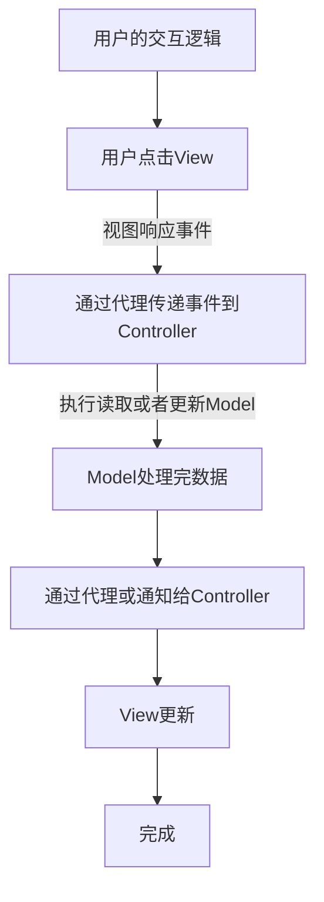
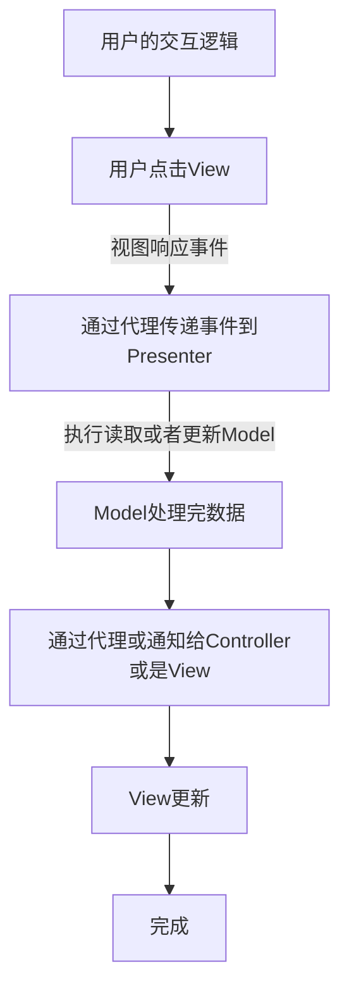
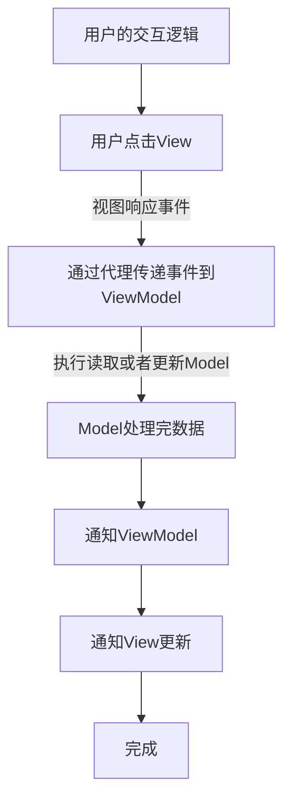

# 设计模式与架构

## 目录

1、[何为架构](#何为架构)

2、[MVC](#MVC)

3、[MVP](#MVP)

4、[MVVM](#MVVM)

## 何为架构

软件开发中的设计方案，类与类之间的关系、模块与模块之间的关系、客户端与服务端之间的关系。

## MVC

> Model：数据层，负责网络数据的处理，数据持久化存储和读取等工作
> 
> View：视图层，负责呈现从数据层传递的数据渲染工作，以及与用户的交互工作
> 
> Controller：控制器，负责连接Model层与View层，响应View的事件和作为View的代理，以及界面跳转和生命周期的处理等任务
> 
> 优点：View、Model可以重复利用，独立使用
> 
> 缺点：Controller代码过于臃肿

## MVP

> Model：数据层，负责网络数据的处理，数据持久化存储和读取等工作
> 
> View：视图层，负责呈现从数据层传递的数据渲染工作，以及与用户的交互工作，Controller也合并到这一层
> 
> Presenter：负责视图需要数据的获取，获取到数据后刷新视图以及响应View的事件和作为View的代理
> 
> 优点：View、Model可以重复利用，独立使用
> 
> 缺点：Presenter替代了Controller的工作，可能造成Presenter代码过于臃肿

## MVVM

> Model：数据层，负责网络数据的处理，数据持久化存储和读取等工作
> 
> View：视图层，负责呈现从数据层传递的数据渲染工作，以及与用户的交互工作，Controller也合并到这一层
> 
> ViewModel：负责视图需要数据的获取，获取到数据后刷新视图以及响应View的事件和作为View的代理
> 
> MVVM 与 MVP主要区别是在MVP基础上加入了双向绑定机制：当被绑定对象某个值的变化时，绑定对象会自动感知，无需被绑定对象主动通知绑定对象
